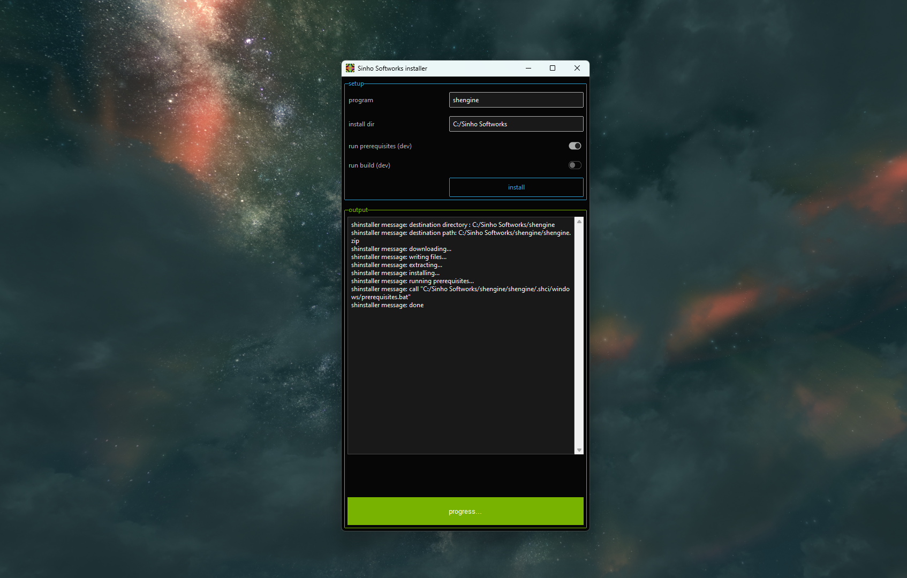

# shinstaller

Universal downloader and installer written in python.



## Dependencies

See `prerequisites/requirements.txt`
 * tkinter
 * ttkbootstrap
 * requests
 * pyinstaller
 * auto-py-to-exe

## Running python file

```
cd shinstaller
python shinstaller.py
```

## Building exe

Run the `auto_py_to_exe` application and set the following settings:
 * input file: `shinstaller/shinstaller.py`
 * output_directory: `shinstaller/`
 * icon_file: `shinstaller/media/noise.ico`
 * one_file: `one_file`
 * console_window: `window_based`

```
python -m auto_py_to_exe
```